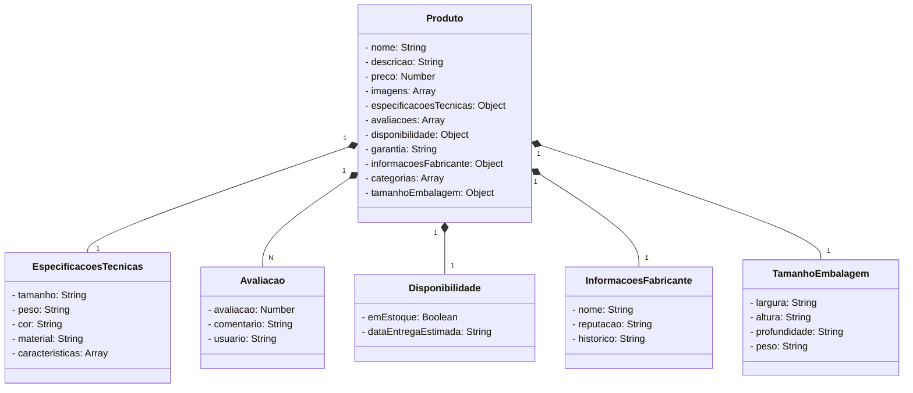

# api-loja
Java RESTful api criada para o desafio santander

Visite no link abaixo

<a href="https://api-sant-desafio.up.railway.app/swagger-ui/index.html" target="_blank">https://api-sant-desafio.up.railway.app/swagger-ui/index.html</a>

<a href="https://api-sant-desafio.up.railway.app/produtos" target="_blank">https://api-sant-desafio.up.railway.app/produtos</a>

## Diagrama

