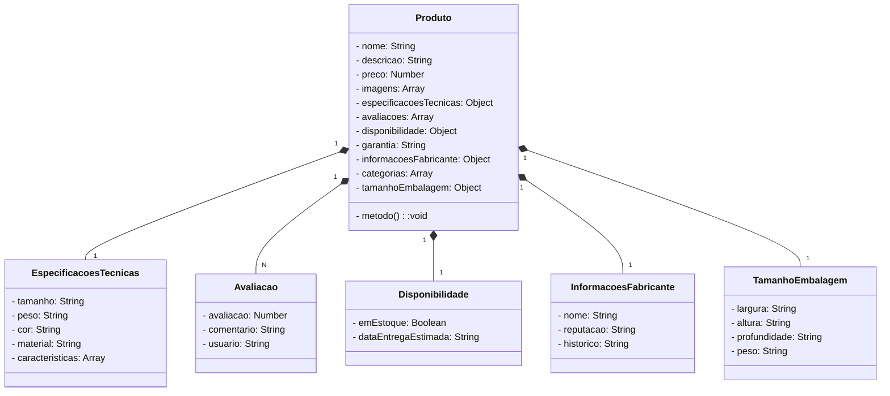

# api-loja
Java RESTful api criada para o desafio santander

## Diagrama

```mermaid

classDiagram
  class Produto {
    - nome: String
    - descricao: String
    - preco: Number
    - imagens: Array
    - especificacoesTecnicas: Object
    - avaliacoes: Array
    - disponibilidade: Object
    - garantia: String
    - informacoesFabricante: Object
    - categorias: Array
    - tamanhoEmbalagem: Object
    - metodo():void
  }

  class EspecificacoesTecnicas {
    - tamanho: String
    - peso: String
    - cor: String
    - material: String
    - caracteristicas: Array
  }

  class Avaliacao {
    - avaliacao: Number
    - comentario: String
    - usuario: String
  }

  class Disponibilidade {
    - emEstoque: Boolean
    - dataEntregaEstimada: String
  }

  class InformacoesFabricante {
    - nome: String
    - reputacao: String
    - historico: String
  }

  class TamanhoEmbalagem {
    - largura: String
    - altura: String
    - profundidade: String
    - peso: String
  }

  Produto "1" *-- "1" EspecificacoesTecnicas
  Produto "1" *-- "N" Avaliacao
  Produto "1" *-- "1" Disponibilidade
  Produto "1" *-- "1" InformacoesFabricante
  Produto "1" *-- "1" TamanhoEmbalagem


```

